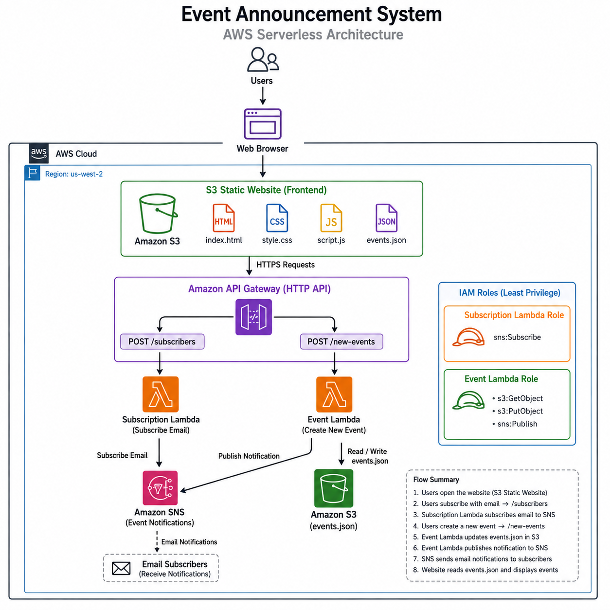
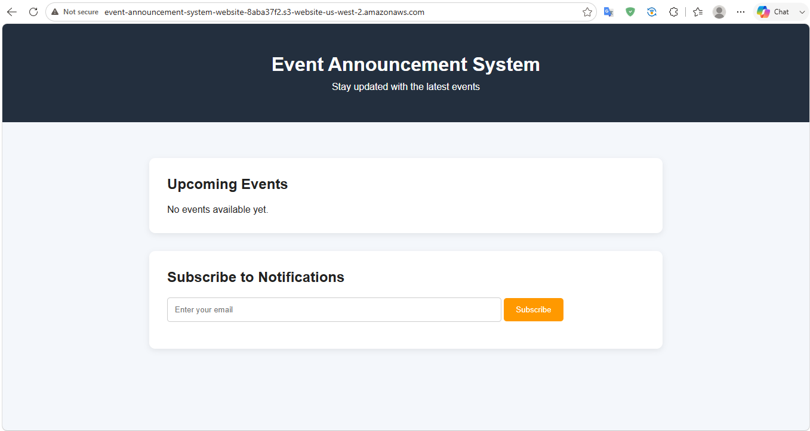
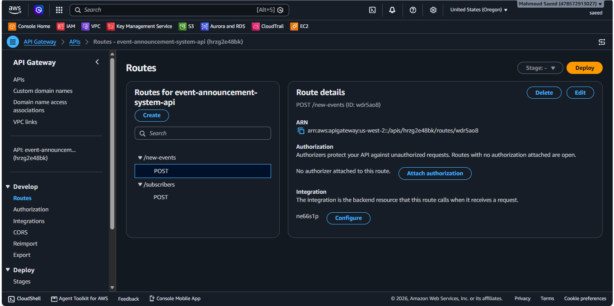
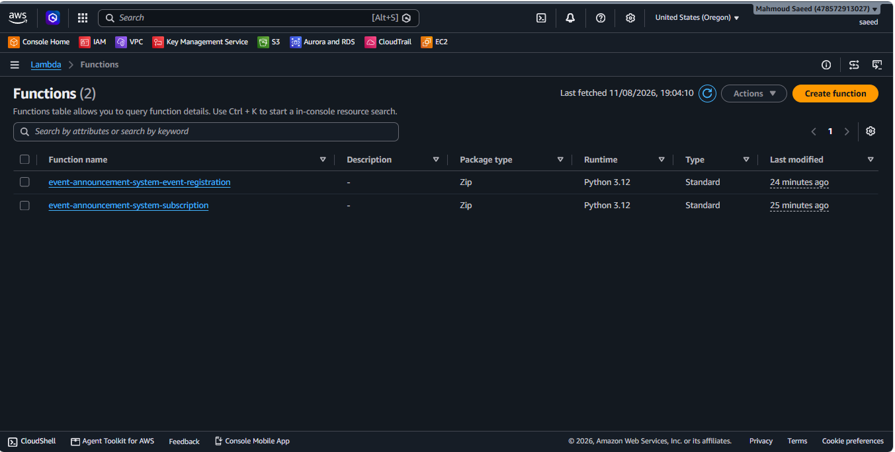
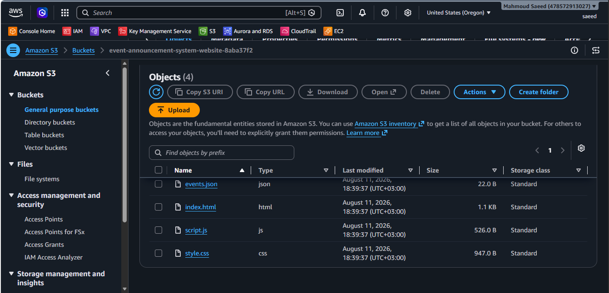
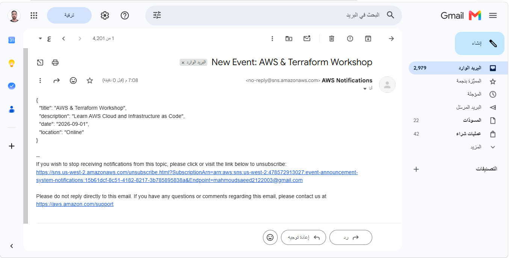
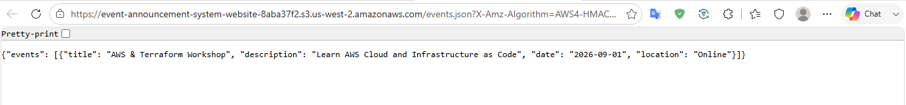

# 📢 Event Announcement System

A serverless event announcement system built on AWS using Terraform.

The application allows users to view available events and subscribe to email notifications. When a new event is created, the backend updates the event data stored in Amazon S3 and sends notifications to confirmed subscribers through Amazon SNS.

The complete AWS infrastructure is provisioned and managed using Terraform.

---

## 🏗️ Architecture



---

## ☁️ AWS Services Used

| AWS Service | Purpose |
|---|---|
| **Amazon S3** | Hosts the static website and stores event data |
| **Amazon API Gateway** | Provides HTTP API endpoints |
| **AWS Lambda** | Runs the serverless backend logic |
| **Amazon SNS** | Manages email subscriptions and sends notifications |
| **AWS IAM** | Controls permissions using IAM roles and policies |
| **Amazon CloudWatch** | Provides Lambda execution logs and monitoring |

---

## 🔄 How It Works

### 1. Website

The frontend is hosted as a static website on Amazon S3.

Users can:

- View available events
- Subscribe using their email address
- Register new events

### 2. Subscribe to Notifications

The subscription flow is:

```text
User
  ↓
S3 Static Website
  ↓
API Gateway
  ↓
Subscription Lambda
  ↓
Amazon SNS
  ↓
Email Confirmation
```

After subscribing, the user receives an SNS confirmation email.

The subscription becomes active after the user confirms it.

### 3. Create a New Event

The event registration flow is:

```text
User
  ↓
S3 Static Website
  ↓
API Gateway
  ↓
Event Registration Lambda
  ↓
Amazon S3
  ↓
Update events.json
  ↓
Amazon SNS
  ↓
Email Notification
```

The Event Registration Lambda function updates the event data stored in S3 and publishes a notification to the SNS topic.

### 4. Display Events

The frontend reads the event data from:

```text
events.json
```

and displays the available events on the website.

---

## 🛠️ Technologies

- AWS
- Terraform
- Python
- JavaScript
- HTML
- CSS
- AWS CLI
- Git
- GitHub

---
## 🤖 AI Assistance

AI was used selectively to assist with parts of the project outside my primary Cloud/DevOps specialization, particularly the frontend (HTML, CSS, JavaScript) and some application-level code.

My main focus was the Cloud/DevOps side of the project, including AWS architecture, Terraform infrastructure, IAM, S3, API Gateway, Lambda infrastructure, SNS, deployment, testing, troubleshooting, and Git/GitHub workflow.

AI supported the application and frontend development, while I focused on designing, provisioning, configuring, testing, and troubleshooting the AWS infrastructure.

## 📁 Project Structure

```text
event-announcement-system/
│
├── terraform/
│   ├── Api_gateway.tf
│   ├── IAM.tf
│   ├── lambda.tf
│   ├── main.tf
│   ├── output.tf
│   ├── provider.tf
│   ├── s3.tf
│   ├── sns.tf
│   ├── variables.tf
│   └── .terraform.lock.hcl
│
├── lambda/
│   ├── event_registration/
│   │   └── lambda_function.py
│   │
│   └── subscription/
│       └── lambda_function.py
│
├── website/
│   ├── events.json
│   ├── index.html
│   ├── script.js
│   └── style.css
│
├── docs/
│   └── screenshots/
│       ├── architecture.png
│       ├── API_gateway.png
│       ├── Lambda_functions.png
│       ├── S3_contents.png
│       ├── SNS_topic&subscription.png
│       ├── Website_view.png
│       ├── email-notification.png
│       └── events-json.png
│
├── .gitignore
└── README.md
```

---

## 🚀 Deployment

### Prerequisites

Make sure you have:

- An AWS account
- AWS CLI installed and configured
- Terraform installed
- Git installed

### 1. Clone the repository

```bash
git clone <YOUR_GITHUB_REPOSITORY_URL>
cd event-announcement-system
```

### 2. Initialize Terraform

```bash
cd terraform
terraform init
```

### 3. Validate the Terraform configuration

```bash
terraform validate
```

### 4. Review the execution plan

```bash
terraform plan
```

### 5. Deploy the infrastructure

```bash
terraform apply
```

Confirm with:

```text
yes
```

### 6. Get Terraform outputs

```bash
terraform output
```

---

## 🧪 Testing

The application was tested through the following flows.

### Website Test

- Open the S3-hosted website
- Verify that events are displayed
- Verify that the subscription form works
- Verify that new events can be submitted

### Subscription Test

1. Submit an email address.
2. API Gateway invokes the Subscription Lambda.
3. Lambda creates an SNS subscription.
4. SNS sends a confirmation email.
5. Confirm the subscription.

### Event Notification Test

1. Create a new event.
2. API Gateway invokes the Event Registration Lambda.
3. Lambda updates `events.json` in S3.
4. Lambda publishes a notification through SNS.
5. Confirmed subscribers receive the notification.
6. The updated event appears on the website.

---

## 📸 Screenshots

### Website



### Architecture


### API Gateway



### Lambda Functions



### S3



### SNS Topic and Subscription


### Email Notification



### Events Data



---

## 🔐 Security

The project applies the principle of least privilege.

- Lambda functions use dedicated IAM roles.
- IAM permissions are limited to the AWS services required by each function.
- Terraform state files are excluded from Git.
- Terraform provider binaries are excluded from Git.
- Lambda deployment ZIP files are excluded from Git.
- AWS credentials are not stored in the repository.

---

## 🧹 Cleanup

To remove the AWS infrastructure created by Terraform:

```bash
cd terraform
terraform destroy
```

Confirm with:

```text
yes
```

---

## 💡 What I Learned

Through this project, I practiced:

- Building serverless applications on AWS
- Hosting static websites with Amazon S3
- Creating HTTP APIs using Amazon API Gateway
- Developing serverless backend logic using AWS Lambda and Python
- Implementing email notifications using Amazon SNS
- Configuring IAM permissions
- Managing AWS infrastructure using Terraform
- Connecting a frontend application with serverless AWS services
- Testing and troubleshooting AWS resources
- Using Git and GitHub to manage infrastructure code

---

## 👨‍💻 Author

**Mahmoud Saeed**

GitHub: [Mahmoud Saeed](https://github.com/mahmoudsaeed152687)
